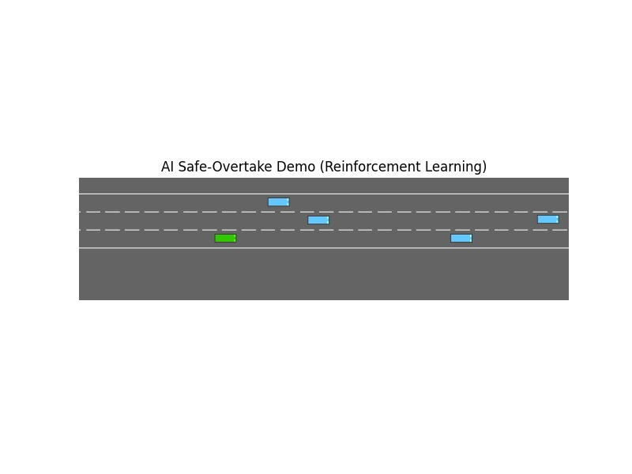

# 🚗 Simulation-Oriented Debugging Agent for Autonomous Car Overtaking

An **AI-powered Reinforcement Learning project** that trains an autonomous vehicle agent to perform **safe and intelligent overtaking maneuvers** on highways.
This system leverages **Simulation-Oriented Debugging** to monitor, analyze, and optimize overtaking decisions using **Deep Q-Networks (DQN)** with **PyTorch** and **Stable Baselines3**.

---

## 🧩 Features

* 🧠 **Simulation-Oriented Debugging** — continuously evaluates and adjusts overtaking logic during simulation.
* ⚙️ **Custom Reward Function** — promotes smooth, safe, and realistic driving behavior.
* 🚀 **GPU-Accelerated Training** — powered by CUDA for efficient learning.
* 🎮 **Real-Time Visualization** — displays live simulation with Matplotlib.
* 💾 **Auto Model Loader** — detects and loads the latest trained model `.zip` file automatically.
* 🧱 **Modular Design** — separate scripts for training and demo execution.

---

## 🗂️ Project Structure

```
📦 Simulation-Oriented-Debugging-Agent/
│
├── main.py                  # Trains the DQN agent (safe overtaking logic)
├── demo_final_autoload.py   # Demonstrates the trained model live
├── rl_overtake_safe_realistic_v2.zip   # Generated model after training
├── output.jpg               # Screenshot of simulation output
└── README.md
```

---

## ⚙️ Installation

### Prerequisites

* Python **3.9+**
* CUDA-compatible GPU (optional but recommended)


---

## 🚀 How to Run

### 🧠 Train the Model

```bash
python main.py
```

This will:

* Configure the **highway simulation** (`highway-v0`)
* Train a **Deep Q-Network (DQN)** for 150,000 timesteps
* Save the trained model as `rl_overtake_safe_realistic_v2.zip`

---

### 🎬 Run the Demo

```bash
python demo_final_autoload.py
```

The demo script will:

* Auto-detect the latest model `.zip` file
* Load the model on GPU
* Render a **live simulation** of overtaking behavior
* Display real-time reward updates

Press **Ctrl + C** anytime to stop the simulation safely.

---

## 🧠 Technical Overview

| Component                  | Description                                                     |
| -------------------------- | --------------------------------------------------------------- |
| **Algorithm**              | DQN (Deep Q-Network)                                            |
| **Framework**              | Stable Baselines3                                               |
| **Simulation Environment** | highway-env (`highway-v0`)                                      |
| **Observation Type**       | Kinematics                                                      |
| **Reward Strategy**        | Safety, smooth speed, lane change efficiency, collision penalty |

---

## 📊 Outputs

Below is a sample output of the simulation after training:

<p align="center">
  
</p>

* 🧩 **Trained Model:** `rl_overtake_safe_realistic_v2.zip`
* 🎥 **Live Simulation:** Real-time vehicle behavior visualization
* 🖥️ **Console Logs:** Step-by-step rewards and total episode summary

---

## 👨‍💻 Author

**Prem Narayan Sharma**
B.Tech CSE (III Year – V Semester)
Department of Computer Engineering and Applications
GLA University, Mathura
📧 [premnsharma2005@outlook.com](mailto:premnsharma2005@outlook.com)

---

## 🧾 Notes

* Modify environment parameters in `make_env()` inside `main.py` for different highway conditions.
* You can skip training by using the existing pre-trained `.zip` model.
* Compatible with both **Windows** and **Linux**.

---

> 💡 *This project demonstrates the fusion of Reinforcement Learning and Simulation-Based Debugging for safe autonomous driving systems — focusing on efficient, explainable, and collision-free overtaking.*
